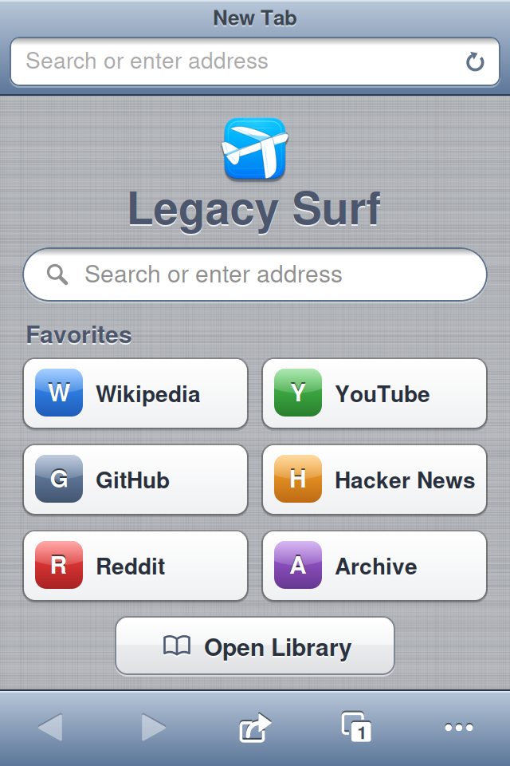
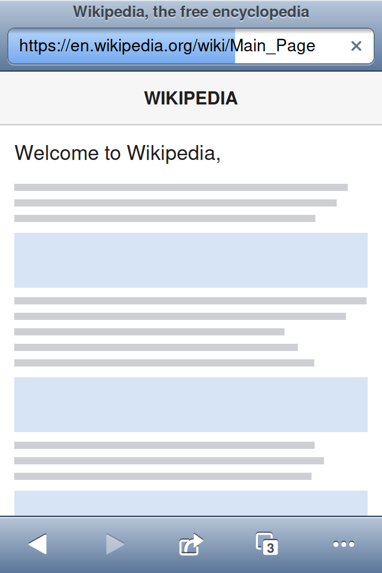
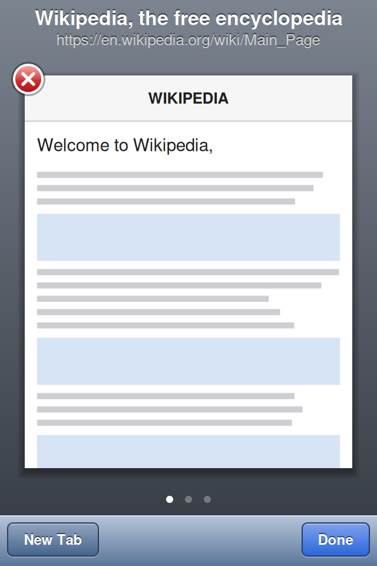
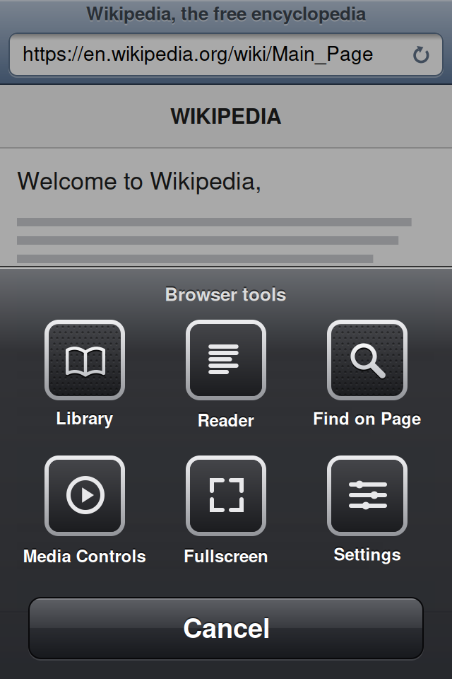
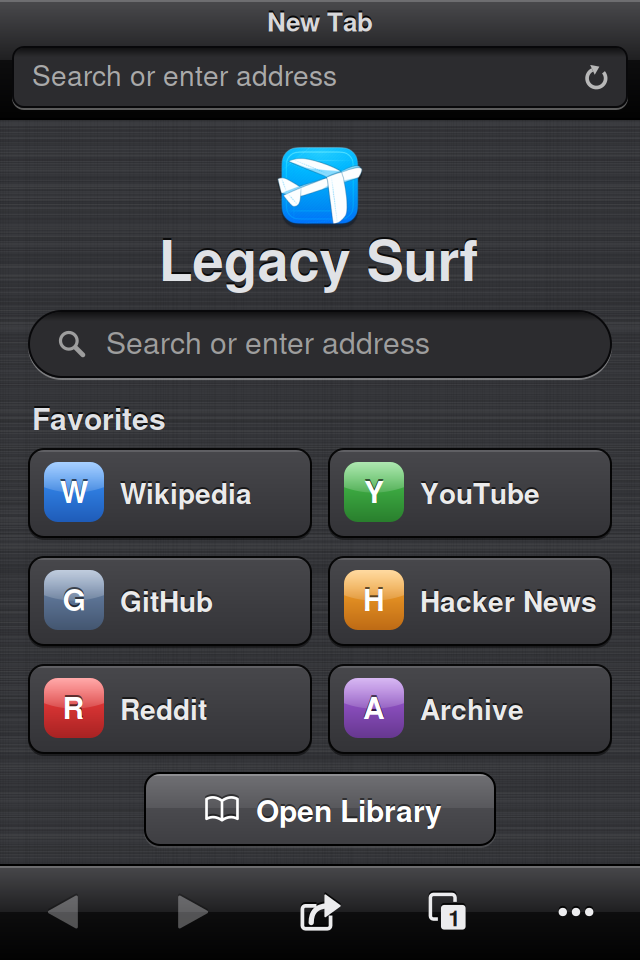
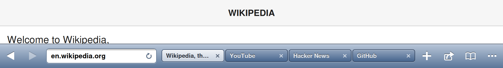

# Legacy Surf

Форк браузера [Surf](https://github.com/seg6/surf) (seg6) — «легасифицированный»
iOS‑клиент: на **iOS 6** у приложения скеоморфный интерфейс в духе Safari из
iOS 6, на iOS 7 и новее остаётся родной плоский дизайн Surf без изменений.
Сайты по‑прежнему работают в Chromium на компьютере (сервер Surf) и
транслируются на устройство.

Разработчик — **LegacyReborn Project**. Иконка — оригинальная иконка Surf.

**Установка**: Cydia-репозиторий LegacyReborn — `http://repo.legacyreborn.cfd/`
(пакет `com.legacyreborn.legacysurf`), или `.deb` со
[страницы релизов](https://github.com/LR-Vensuki/LegacySurf/releases). Нужен
сервер [Surf](https://github.com/seg6/surf/releases) 0.17.x на компьютере.









> Картинки в `docs/` — рендеры прототипа отрисовки (`scripts/design`, Cairo),
> который повторяет CoreGraphics‑код скина. Лён, шрифты и глифы Lucide в них
> приблизительные, на устройстве детали могут отличаться.

## Оформление на iOS 6

Вся графика рисуется в рантайме (`Classes/RBClassicSkin.m`), цвета сняты с
Safari и UIKit iOS 6. Никаких картинок Apple в пакете нет; лён и «полоски»
берутся из самой системы.

| Экран | Что стало |
|---|---|
| Адресная строка (iPhone) | Сине‑серая панель Safari: заголовок страницы сверху, под ним вдавленное поле с внутренней тенью; во время загрузки поле заливается голубым, справа круговая стрелка / крестик |
| Нижний тулбар (iPhone) | Тулбар iOS 6 с белыми «выгравированными» глифами (назад/вперёд треугольниками, «поделиться», «страницы» с числом вкладок внутри, «ещё») и системным свечением при нажатии |
| Панель iPad | Тот же тулбар; вкладки — бордюрные кнопки, активная светлая |
| Новая вкладка | Лён Safari, тиснёный заголовок «Legacy Surf», поле‑«пилюля» поиска, глянцевые карточки избранного с иконками‑плитками, серебристая кнопка Library |
| Вкладки (Pages) | Как Pages в Safari 6: сланцевый фон, заголовок и адрес над страницей, красный крестик на углу, белые точки, «New Tab» / «Done» на тулбаре; переход — переворот |
| Меню инструментов | Тёмный лист как у share‑sheet iOS 6: перфорированные «металлические» иконки, белые подписи, чёрная кнопка Cancel; на iPad — в тёмно‑синем поповере |
| Поиск по странице | Системное поле iOS 6, треугольные стрелки, синяя кнопка Done |
| Подсказки, тосты, кнопки полноэкранного режима | Выпадающий список с рамкой, HUD‑плашки iOS 6 |
| Настройки, серверы, сопряжение, библиотека, медиа | Родные навбары и таблицы iOS 6 («полоски»), тиснёный текст, глянцевые синие и серебристые кнопки |
| Тёмная тема | Чёрные глянцевые бары, тёмный лён, тёмное вдавленное поле |

## Совместимость с сервером

- Работает с сервером **Surf 0.17.x** (поколение протокола 1). Серверу
  приложение представляется как Surf 0.17.0 (`SURF_BASE_VERSION`), протокол
  не менялся.
- Это отдельное приложение: `com.legacyreborn.legacysurf`,
  `/Applications/LegacySurf.app`, свои данные в
  `/var/mobile/Library/LegacySurf`. Ставится рядом с оригинальным Surf, но
  сервер нужно **сопрячь заново** (свой ключ устройства).
- Встроенное обновление клиента отключено: сервер раздаёт пакет оригинального
  Surf, а не этого форка. Если сервер новее по протоколу, приложение просто
  скажет об этом. setuid‑помощник `surf-update-v2` в пакет не входит.
- URL‑схемы: `legacysurf:`, `legacysurf-http://…`, `legacysurf-https://…`
  (чтобы не спорить с Surf за `surf:`). QR‑коды сопряжения сервера
  (`surf://pair?…`) сканируются внутри приложения как раньше.

## Сборка

Нужны [Theos](https://theos.dev) и **iPhoneOS8.0.sdk** в `$THEOS/sdks`: только
в нём есть заглушки и для armv7 (iOS 6), и для arm64 (iOS 7+). Это тот же SDK,
что использует upstream:

```sh
curl -LO https://github.com/GrowtopiaJaw/iPhoneOS-SDK/releases/download/v1.0/iPhoneOS8.0.sdk.zip
echo '5e770b202937ca31b8547aa4dbef7543e3aa261f6b744012745604588e927b05  iPhoneOS8.0.sdk.zip' | sha256sum -c -
unzip -q iPhoneOS8.0.sdk.zip -d "$THEOS/sdks"
```

Затем:

```sh
make package          # packages/com.legacyreborn.legacysurf_1.0.0_iphoneos-arm.deb
./verify-package.sh   # архитектуры, минимальные iOS, weak-импорт для iOS 6, plist, иконки
make do THEOS_DEVICE_IP=192.168.1.20   # собрать и поставить по SSH
```

Theos не собирает проекты, в пути которых есть пробелы (а эта папка —
«Surf Skeomorphic Version»). Makefile это сам замечает и передаёт цели в
`build.sh`: тот зеркалит исходники в `~/.cache/legacysurf-theos`, собирает там
и кладёт `.deb` обратно в `packages/`. Каталог зеркала можно поменять через
`LEGACYSURF_BUILD_DIR`.

По умолчанию собирается релиз (`FINALPACKAGE=1`); отладочная сборка —
`make package FINALPACKAGE=0`. Пакет сжат gzip, чтобы его понимал dpkg на
iOS 6.

### Установка вручную

```sh
scp packages/com.legacyreborn.legacysurf_*.deb root@DEVICE_IP:/tmp/legacysurf.deb
ssh root@DEVICE_IP 'dpkg -i /tmp/legacysurf.deb'
```

`postinst` сам выбирает иконку под версию iOS (прозрачная классическая для
iOS 6, непрозрачная для iOS 7+) и вызывает `uicache`.

## Версии

| Файл | Что это |
|---|---|
| `VERSION` | версия Legacy Surf (пакет, `CFBundleShortVersionString`) |
| `SURF_BASE_VERSION` | версия Surf, на которой основан форк; её видит сервер |
| `COMPATIBILITY_VERSION` | поколение протокола Surf, должно совпадать с сервером |

`control` и `Resources/Info.plist` генерируются из `control.in` и
`Info.plist.in` при каждой сборке — правьте шаблоны.

## Устройство проекта

```text
Classes/            Objective-C клиент (UIKit), из upstream client/ios/Classes
  RBClassicSkin.*   iOS 6 скин: бары, глифы, кнопки, поля, бейджи, плитки
  RBTheme.*         тема; на iOS < 7 направляет всё в RBClassicSkin
core/               C99 ядро клиента Surf, без изменений (upstream client/core)
Resources/          ресурсы бандла (шрифт Lucide, логотип, launch-картинки)
Icons/              исходники иконки Surf; Makefile раскладывает их в бандл
Artwork/            исходная иконка Deta Surf и лицензии
Scripts/            legacysurf-select-icons (выбор иконки в postinst)
scripts/design/     Cairo-прототип скина и генератор docs/preview-*.png
depiction/          описание пакета для Cydia-репозитория
```

Скеоморфный вид включается ровно тогда, когда
`+[RBTheme usesClassicAppearance]` (iOS < 7) — все изменения внешнего вида
спрятаны за этой проверкой, поэтому ветка iOS 7+ осталась upstream‑овской.

## Обновление из upstream

Форк сделан с [seg6/surf@8923842](https://github.com/seg6/surf/commit/8923842c69095241412cafa7abe1845d58dd4e74)
(Surf 0.17.0). Чтобы подтянуть новый Surf: перенести изменения
`client/ios/Classes` и `client/core` поверх `Classes/` и `core/`, обновить
`SURF_BASE_VERSION` (и `COMPATIBILITY_VERSION`, если upstream его поднял) и
проверить экраны на iOS 6. Отличия форка: `RBClassicSkin.*`, ветки
`usesClassicAppearance` в видах, отключённый апдейтер, переименованные
идентификаторы и строки.

## Лицензии

- Код — MIT: © seg6 (Surf) и © LegacyReborn Project (изменения), см. `LICENSE`.
- Иконка — Apache 2.0, Deta GmbH / Negative Entropy, см. `THIRD_PARTY_NOTICES.md`.
- Шрифт Lucide — ISC, quirc — ISC.

Legacy Surf не связан с seg6 и не одобрен им.
